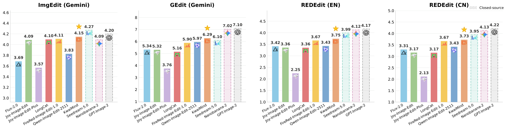
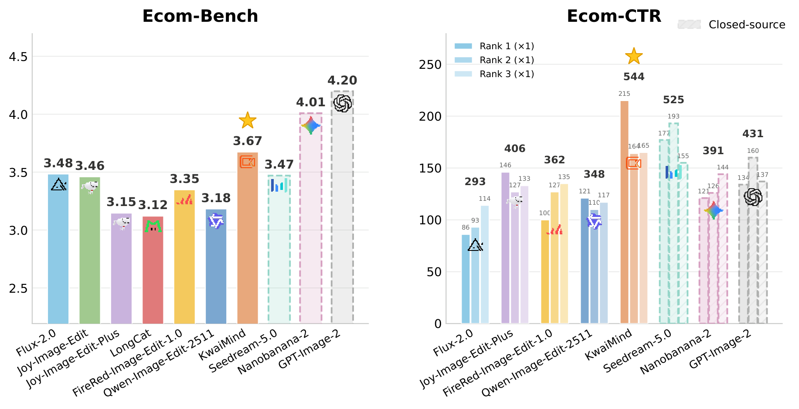

<div align="center">


<br>


[](LICENSE)
[](https://huggingface.co/datasets/laziji402/Kwai-Ecom-Bench)
[](#e-com-bench)

</div>

---

## Introduction

KwaiMind targets the image edits that e-commerce actually needs — background replacement, virtual try-on, selling-point overlays, text editing on product shots — while holding its ground on general-purpose editing benchmarks.

This repository provides minimal inference code and reproducible runners for both the general benchmarks and **E-com Bench**, our 1,100-case e-commerce benchmark. Model weights and benchmark images are distributed separately.

## News

- **2026.09.22**: We released the KwaiMind technical report.

## Results

Scores on the public general-purpose editing benchmarks. ImgEdit and GEdit are scored with Gemini as judge; REDEdit uses its official bilingual protocol.

<div align="center">

</div>

On E-com Bench, KwaiMind leads both the judge-scored quality metric and the CTR ranking, which counts how often a model's edit is preferred by a click-through-rate predictor trained on real e-commerce traffic.

<div align="center">

</div>

> Hatched bars mark closed-source models, which we report for reference rather than as the primary comparison.

## Installation

```bash
conda create -n kwaimind python=3.12 -y
conda activate kwaimind
pip install -r requirements.txt
pip install -e . --no-deps
```

The pinned requirements reflect the environment used for evaluation. An NVIDIA GPU with BF16 support is required. The editable install is what puts the `kwaimind` package on the import path, so `examples/infer.py` cannot run without it.

## Inference

```bash
python examples/infer.py \
  --checkpoint /path/to/KwaiMind/checkpoint \
  --manifest examples/manifest.json \
  --output-dir outputs/example
```

The bundled examples are configured in `examples/manifest.json`. Point `--manifest` at your own file to edit other images.

A checkpoint directory must contain `diffusion_pytorch_model.safetensors.index.json` and all referenced shards. KwaiMind checkpoints contain the transformer only; Qwen text encoder, VAE, and processor weights are downloaded by DiffSynth-Studio.

Manifest format:

```json
[
  {
    "id": "0000",
    "prompt": "Transfer the image into a Lego-brick stop-motion diorama style.",
    "images": ["images/input_Lego.png"]
  }
]
```

Multi-image editing uses an ordered `images` list.

### Generation defaults

These defaults reproduce the settings used for the reported benchmark scores. Change them only when you intend to depart from the published numbers.

| Setting | Default | Flag |
|---|---|---|
| Inference steps | 40 | `--steps` |
| Seed | 42 | `--seed` |
| CFG scale | 4.0 | `--cfg-scale` |
| Negative prompt | empty | `--negative-prompt` |
| Pixel budget | 1,440,000 | `--max-pixels` |
| Size alignment | nearest multiple of 16 | `--rounding {nearest,floor}` |
| Single reference passing | `list` | `--single-image-mode {list,pil}` |
| `edit_image_auto_resize` | enabled | `--no-auto-resize` |
| `zero_cond_t` | enabled | `--no-zero-cond-t` |

Two of these change results and are worth understanding:

- **Size alignment.** Output sides are rounded to the *nearest* multiple of 16, ties upward, so a 750×750 input renders at 752×752. `--rounding floor` truncates instead (736×736) and changes benchmark conditions on inputs that are not already a multiple of 16.
- **Single reference passing.** With one reference image, `list` routes through DiffSynth's `encode_prompt_edit_multi` prompt template; `pil` passes the bare image and routes through `encode_prompt_edit`. The reported results use `list`.

`zero_cond_t` is enabled at inference regardless of the `zero_cond_t` field in a checkpoint's `config.json`, which reflects the base model's training-time configuration rather than the inference recipe.

## General benchmarks

The repository provides adapters for ImgEdit-Bench, REDEdit-Bench, and GEdit-Bench. Download each benchmark from its official source, then convert it to the common manifest format:

```bash
python benchmarks/general/prepare.py \
  --benchmark imgedit \
  --source /path/to/singleturn.json \
  --image-root /path/to/singleturn \
  --output data/imgedit.json

python examples/infer.py \
  --checkpoint /path/to/KwaiMind/checkpoint \
  --manifest data/imgedit.json \
  --output-dir outputs/imgedit
```

Use each benchmark's official evaluator for reported scores.

## E-com Bench

E-com Bench contains 1,100 cases across 11 e-commerce editing tasks. Two of them take two input images; the rest take one.

| Task | Manifest | Cases | Input images |
|---|---|---|---|
| Virtual Try-On | `virtual_tryon` | 100 | 2 |
| Clothing Detail | `clothing_detail` | 100 | 1 |
| Clothing Display | `clothing_display` | 100 | 1 |
| Universal Wearing | `universal_wearing` | 100 | 2 |
| Pose Change | `pose_change` | 100 | 1 |
| Background Replace | `background_replace` | 100 | 1 |
| Outpaint | `outpaint` | 100 | 1 |
| Product Extract | `product_extract` | 100 | 1 |
| Text Edit | `text_edit` | 100 | 1 |
| Tagline Removal | `tagline_removal` | 100 | 1 |
| Selling Point Display | `selling_point_display` | 100 | 1 |
| **Total** | | **1,100** | |

### Evaluation Dimensions

Each task is evaluated on four dimensions. The G and E prefixes denote general and e-commerce-specific dimensions, respectively.

| Task | D1 | D2 | D3 | D4 |
|---|---|---|---|---|
| Virtual Try-On | E5 Fit & Silhouette | E3 Texture | G2 Seamless | G3 Physical |
| Clothing Detail | E1 Product Id. | E3 Texture | G5 Quality | G6 Aesthetics |
| Clothing Display | E3 Texture | E4 Model | G3 Physical | G6 Aesthetics |
| Universal Wearing | E1 Product Id. | E4 Model | G2 Seamless | G3 Physical |
| Pose Change | E4 Model | E5 Fit & Silhouette | G1 Comply | G3 Physical |
| Background Replace | G1 Comply | E1 Product Id. | E8 Complete | G3 Physical |
| Outpaint | G4 Preserve | E8 Complete | E1 Product Id. | G2 Seamless |
| Product Extract | E6 Cutout | E1 Product Id. | G1 Comply | G5 Quality |
| Text Edit | E2 TextAcc. | E1 Product Id. | G2 Seamless | G4 Preserve |
| Tagline Removal | G1 Comply | E1 Product Id. | E8 Complete | G2 Seamless |
| Selling Point Display | E7 SellingPt. | E2 TextAcc. | G1 Comply | G6 Aesthetics |

The JSON manifests and judge prompts are included in the [KwaiMind-Ecom-Bench dataset](https://huggingface.co/datasets/laziji402/Kwai-Ecom-Bench). The commands below download it to the sibling directory `../KwaiMind-Ecom-Bench` by default. The runner resolves paths relative to the KwaiMind repository, so it works regardless of the current working directory. You can override the location with `KWAIMIND_ECOM_ROOT` or `--data-root`. The dataset directory must contain `data/*.json`, `judge/task_judge_prompts.jsonl`, and `images/`.

Download the dataset once. Because the dataset is private, authenticate first with a Hugging Face token that has read access:

```bash
hf auth login
bash benchmarks/ecom/download.sh
```

By default, the dataset is downloaded to the sibling directory `../KwaiMind-Ecom-Bench`, which is the default location recognized by both E-com runners. To use another location:

```bash
bash benchmarks/ecom/download.sh --data-root /path/to/KwaiMind-Ecom-Bench
```

Run inference on one node:

```bash
export KWAIMIND_ECOM_ROOT=/path/to/KwaiMind-Ecom-Bench
bash benchmarks/ecom/run_inference.sh \
  --checkpoint /path/to/KwaiMind/checkpoint
```

For multi-node inference, run the same command on each node with a distinct rank and a shared output directory:

```bash
bash benchmarks/ecom/run_inference.sh \
  --checkpoint /path/to/KwaiMind/checkpoint \
  --data-root /path/to/KwaiMind-Ecom-Bench \
  --rank 0 \
  --world-size 4
```

Run the public Gemini evaluator:

```bash
export GEMINI_API_KEY=your_api_key
bash benchmarks/ecom/run_evaluation.sh \
  --data-root /path/to/KwaiMind-Ecom-Bench
```

Images are sent to the configured Gemini API during evaluation. Review your data policy before enabling cloud evaluation. The final score is the mean of per-task scores; each case score is the geometric mean of its four task-specific dimensions.

## License

Unless otherwise noted, original KwaiMind code and documentation in this repository are released under [Creative Commons Attribution–NonCommercial–NoDerivatives 4.0 International (CC BY-NC-ND 4.0)](LICENSE).

- Noncommercial use only; commercial use is prohibited under this license.
- Sharing unmodified licensed materials requires appropriate attribution and compliance with the license terms.
- The license permits producing and reproducing adapted materials for noncommercial purposes, but does not permit sharing adapted materials.

## Showcase

<div align="center">
  <a href="assets/showcases.pdf">
    
  </a>
</div>

## 🤝 Acknowledgements

We would like to thank the developers of [Qwen-Image](https://github.com/QwenLM/Qwen-Image), [DiffSynth-Studio](https://github.com/modelscope/DiffSynth-Studio), [ImgEdit](https://github.com/PKU-YuanGroup/ImgEdit), [GEdit-Bench](https://github.com/stepfun-ai/Step1X-Edit), and [REDEdit-Bench](https://github.com/FireRedTeam/FireRed-Image-Edit) for sharing their work with the community.

## Citation

```bibtex
@misc{kwaimind2026,
  title={KwaiMind},
  author={KwaiMMU Team},
  year={2026},
  url={https://github.com/KwaiMmu/KwaiMind}
}
```
